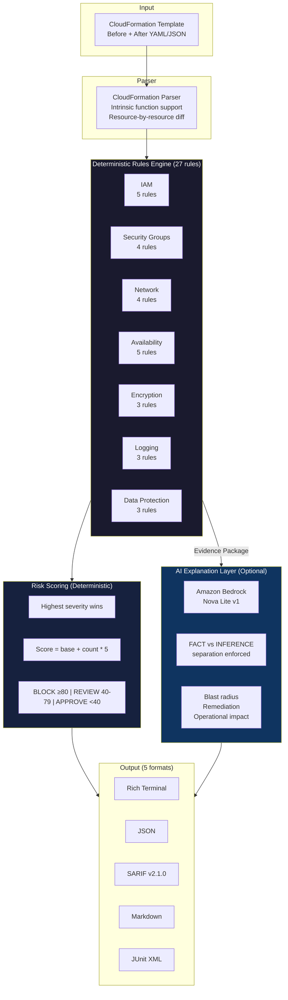
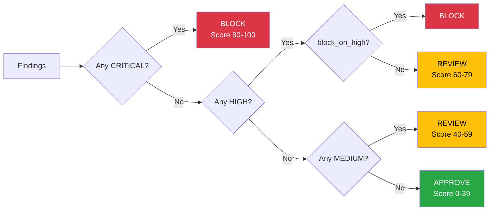
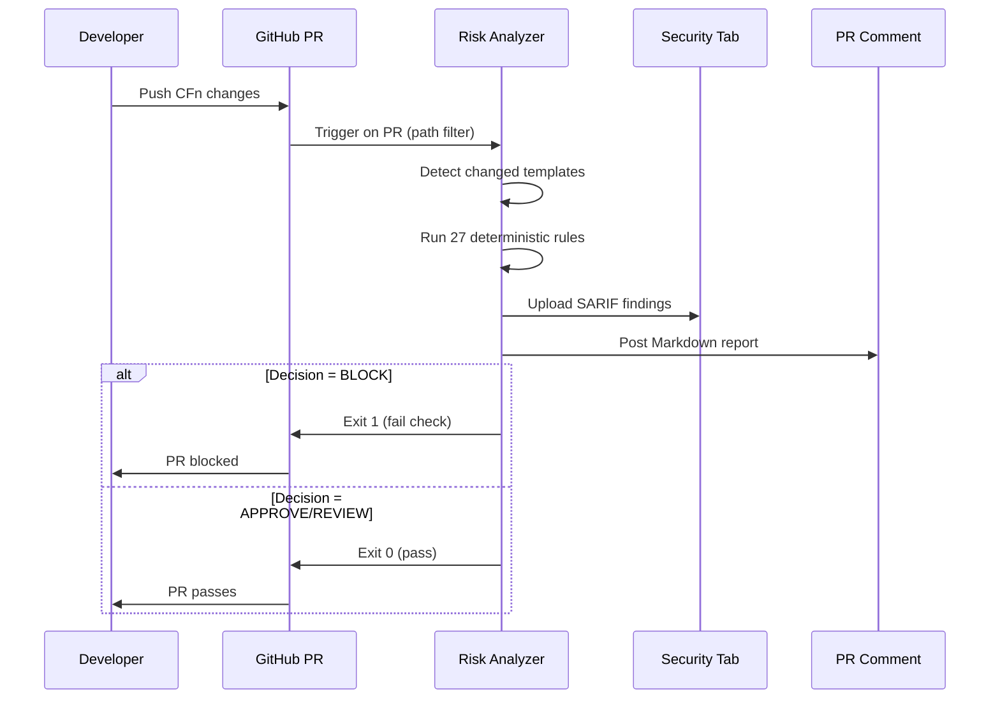
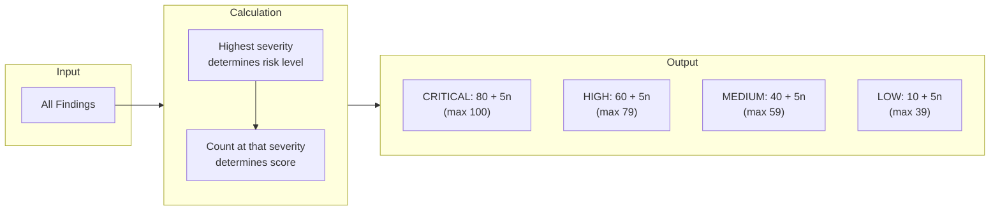
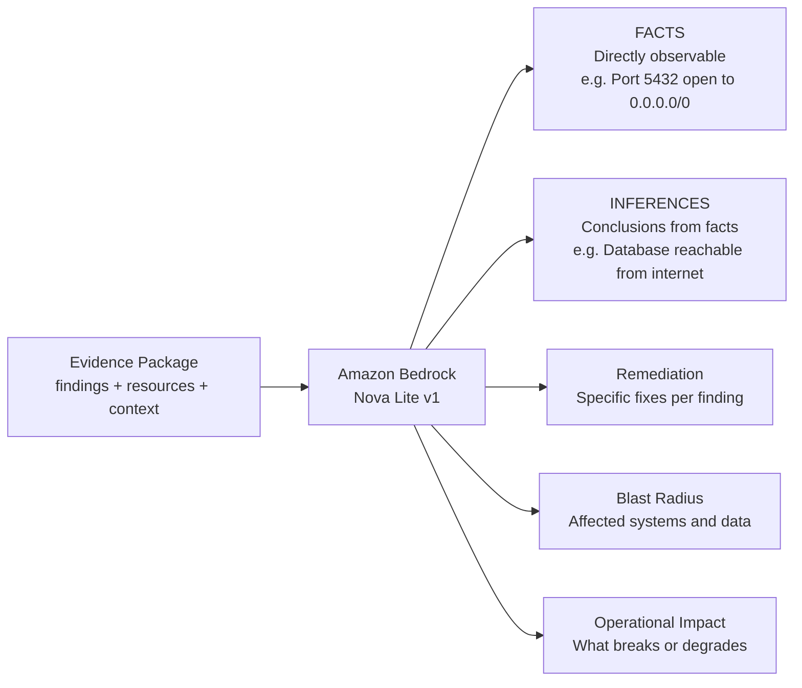
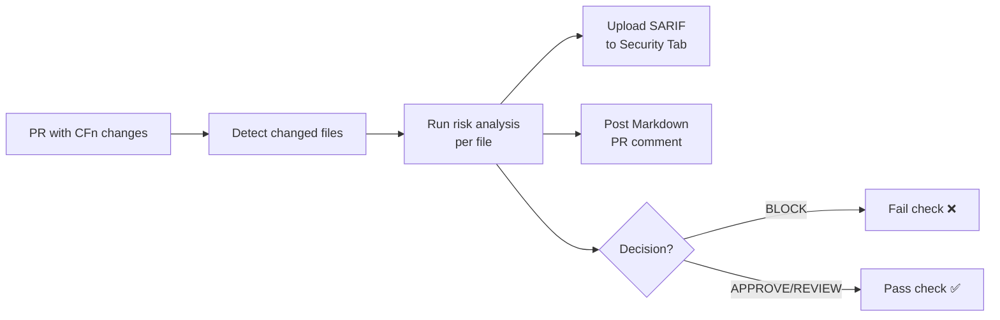
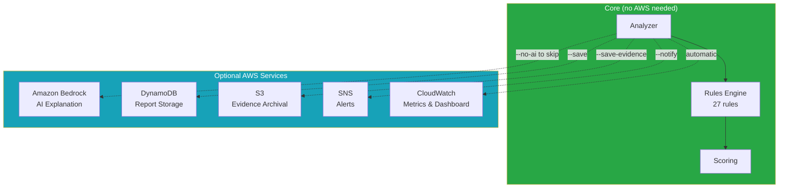
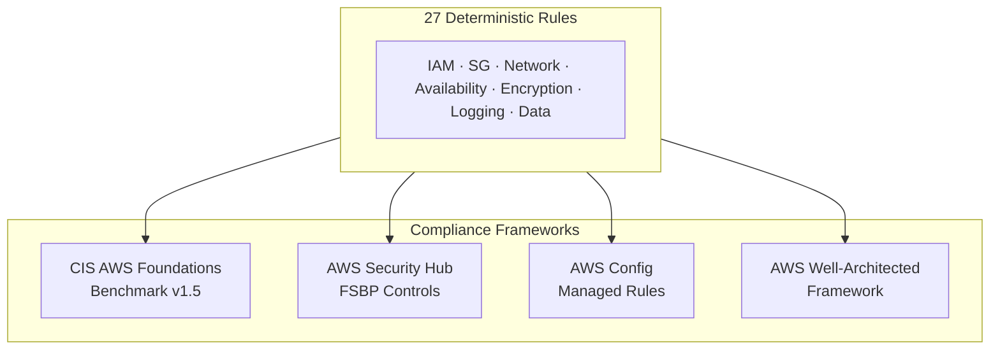

# Production Change Risk Analyzer

**Evidence-based infrastructure change risk analysis for AWS CloudFormation.** 27 deterministic rules detect security, availability, encryption, logging, and data protection risks. AI explains the findings — it never decides BLOCK or APPROVE.

[](https://github.com/vellankikoti/production-change-risk-analyzer/actions)
[](LICENSE)
[](https://www.python.org/downloads/)

---

## The Problem

Production deployments fail because teams push CloudFormation changes without understanding the risk surface:
- Security groups silently open to `0.0.0.0/0`
- IAM policies granting `Action: "*", Resource: "*"`
- Multi-AZ disabled on production RDS
- Encryption missing from S3/RDS/EBS
- CloudTrail logging deleted
- Backup retention set to 0 days

These patterns are **detectable before deployment**, not after an incident.

## What Makes This Different

| Feature | This Tool | Typical IaC Scanners |
|:--------|:----------|:--------------------|
| Decision model | Deterministic thresholds (never AI) | AI/ML black box or simple pass/fail |
| AI role | Explains findings with FACT/INFERENCE separation | N/A or unstructured |
| Compliance | Every rule mapped to CIS, SecurityHub, Config, Well-Architected | Partial or manual |
| Before/after diff | Compares current vs proposed templates | Scans proposed only |
| Output formats | Rich, JSON, SARIF, Markdown, JUnit | Usually one or two |
| Configuration | Per-environment thresholds, suppressions with expiry | Global on/off |
| AWS dependency | Optional — works fully offline with `--no-ai` | Usually required |

---

## Architecture



### Decision Flow



### CI/CD Integration Flow



---

## Quick Start

### Step 1: Install (2 minutes)

```bash
git clone https://github.com/vellankikoti/production-change-risk-analyzer.git
cd production-change-risk-analyzer

# Using uv (recommended)
uv venv && source .venv/bin/activate
uv pip install -r requirements.txt

# Or using pip
python -m venv .venv && source .venv/bin/activate
pip install -r requirements.txt
```

### Step 2: Analyze your first template (30 seconds)

```bash
# No AWS credentials needed — fully deterministic
python cli.py analyze \
  --after tests/fixtures/templates/dangerous_changes.yaml \
  --no-ai

# Compare before vs after
python cli.py analyze \
  --before tests/fixtures/templates/secure_baseline.yaml \
  --after tests/fixtures/templates/dangerous_changes.yaml \
  --environment production \
  --no-ai
```

**Expected output:** CRITICAL / BLOCK with findings for IAM admin access, all-traffic security group, reduced ASG capacity, disabled Multi-AZ, and removed backups.

### Step 3: Enable AI explanation (optional)

```bash
# Requires: AWS CLI configured + Bedrock access to amazon.nova-lite-v1:0
python cli.py analyze \
  --before tests/fixtures/templates/secure_baseline.yaml \
  --after tests/fixtures/templates/dangerous_changes.yaml \
  --environment production
```

AI adds: explanation with FACT/INFERENCE labels, blast radius assessment, operational impact, and specific remediation steps.

### Step 4: Validate the rules engine

```bash
# Run all 7 evaluation scenarios
python cli.py eval
# Expected: 7/7 PASS, 100% accuracy

# Run unit tests
pytest tests/ -v
# Expected: 150+ tests passing
```

---

## Docker

```bash
# Build
docker build -t risk-analyzer .

# Analyze a template
docker run -v $(pwd)/templates:/templates risk-analyzer \
  cli.py analyze --after /templates/my-stack.yaml --no-ai

# With AI (pass AWS credentials)
docker run \
  -e AWS_ACCESS_KEY_ID -e AWS_SECRET_ACCESS_KEY -e AWS_REGION \
  -v $(pwd)/templates:/templates \
  risk-analyzer cli.py analyze --after /templates/my-stack.yaml

# Web dashboard
docker run -p 8501:8501 \
  -e AWS_ACCESS_KEY_ID -e AWS_SECRET_ACCESS_KEY -e AWS_REGION \
  risk-analyzer web_server.py
```

---

## Output Formats

### Rich Terminal (default)
```bash
python cli.py analyze --after template.yaml --no-ai
```
Color-coded severity, resource tables, findings with compliance tags, AI sections.

### JSON
```bash
python cli.py analyze --after template.yaml --format json | jq '.decision'
```

### SARIF v2.1.0 (GitHub Security Tab)
```bash
python cli.py analyze --after template.yaml --format sarif --output-file results.sarif
```
Upload to GitHub Security tab — findings appear inline on the PR diff.

### Markdown (PR Comments)
```bash
python cli.py analyze --after template.yaml --format markdown --output-file report.md
```

### JUnit XML (CI Test Reporting)
```bash
python cli.py analyze --after template.yaml --format junit --output-file results.xml
```

---

## Complete Rules Reference (27 Rules)

Every rule maps to: **CIS AWS Foundations Benchmark**, **AWS Security Hub**, **AWS Config Rules**, and **AWS Well-Architected Framework**.

### IAM — Identity & Access Management (5 rules)

| Rule | What It Detects | Severity | CIS | SecurityHub | Well-Architected |
|:-----|:---------------|:---------|:----|:------------|:-----------------|
| IAM-001 | Wildcard actions (`Action: "*"`) | CRITICAL | 1.16 | IAM.1 | — |
| IAM-002 | Wildcard resources (`Resource: "*"`) | HIGH | 1.16 | IAM.1 | SEC03-BP07 |
| IAM-003 | Full admin (`Action: "*"` + `Resource: "*"`) | CRITICAL | 1.16 | IAM.1 | SEC03-BP07 |
| IAM-004 | Privilege escalation (`iam:PassRole`, `sts:AssumeRole *`) | HIGH | 1.16 | IAM.1 | SEC03-BP06 |
| IAM-005 | Broad data access (`s3:*`, `dynamodb:*`) | MEDIUM | 1.16 | — | SEC03-BP07 |

### Security Groups — Network Access Control (4 rules)

| Rule | What It Detects | Severity | CIS | SecurityHub | Well-Architected |
|:-----|:---------------|:---------|:----|:------------|:-----------------|
| SG-001 | 0.0.0.0/0 to sensitive ports (22, 3389, 3306, 5432, etc.) | CRITICAL | 5.2, 5.3 | EC2.19 | SEC05-BP02 |
| SG-002 | Unrestricted ingress 0.0.0.0/0 on any port | MEDIUM | 5.2 | EC2.18 | — |
| SG-003 | Port ranges wider than 100 ports | MEDIUM | — | — | SEC05-BP02 |
| SG-004 | All traffic (protocol `-1`) from any source | CRITICAL | 5.2, 5.3 | EC2.19 | SEC05-BP02 |

### Network — VPC & Routing (4 rules)

| Rule | What It Detects | Severity | CIS | SecurityHub | Well-Architected |
|:-----|:---------------|:---------|:----|:------------|:-----------------|
| NET-001 | Subnet associated with IGW route table | HIGH | 5.1 | — | SEC05-BP01 |
| NET-002 | NAT Gateway deletion | HIGH | — | — | REL02-BP01 |
| NET-003 | NACL allowing all inbound from 0.0.0.0/0 | MEDIUM | 5.1 | EC2.21 | SEC05-BP02 |
| NET-004 | Default route to Internet Gateway | HIGH | 5.1 | — | SEC05-BP01 |

### Availability — Resilience & Recovery (5 rules)

| Rule | What It Detects | Severity | CIS | SecurityHub | Well-Architected |
|:-----|:---------------|:---------|:----|:------------|:-----------------|
| AVAIL-001 | ASG desired capacity reduction | MEDIUM | — | — | REL06-BP01 |
| AVAIL-002 | ASG min capacity below 2 | HIGH | — | — | REL10-BP01 |
| AVAIL-003 | Multi-AZ disabled on RDS | CRITICAL | — | RDS.5 | REL10-BP01 |
| AVAIL-004 | Deletion of critical resources (RDS, DynamoDB, ECS, EKS) | CRITICAL | — | — | OPS08-BP01 |
| AVAIL-005 | Backup retention reduced to 0 days | HIGH | — | RDS.11 | REL09-BP01 |

### Encryption — Data at Rest (3 rules)

| Rule | What It Detects | Severity | CIS | SecurityHub | Well-Architected |
|:-----|:---------------|:---------|:----|:------------|:-----------------|
| ENC-001 | S3 bucket without server-side encryption | HIGH | 2.1.1 | S3.4 | SEC08-BP02 |
| ENC-002 | RDS instance without storage encryption | CRITICAL | 2.3.1 | RDS.3 | SEC08-BP02 |
| ENC-003 | EBS volume without encryption | HIGH | 2.2.1 | EC2.3 | SEC08-BP02 |

### Logging & Monitoring (3 rules)

| Rule | What It Detects | Severity | CIS | SecurityHub | Well-Architected |
|:-----|:---------------|:---------|:----|:------------|:-----------------|
| LOG-001 | S3 bucket without access logging | MEDIUM | 3.6 | S3.9 | SEC04-BP02 |
| LOG-002 | CloudTrail trail deletion | CRITICAL | 3.1 | CloudTrail.1 | SEC04-BP01 |
| LOG-003 | CloudTrail logging disabled | CRITICAL | 3.1 | CloudTrail.1 | SEC04-BP01 |

### Data Protection — Public Exposure & Deletion Safety (3 rules)

| Rule | What It Detects | Severity | CIS | SecurityHub | Well-Architected |
|:-----|:---------------|:---------|:----|:------------|:-----------------|
| S3-001 | S3 bucket without public access block | CRITICAL | 2.1.5 | S3.1, S3.2, S3.3 | SEC08-BP04 |
| RDS-001 | RDS instance with `PubliclyAccessible: true` | CRITICAL | 2.3.2 | RDS.2 | SEC05-BP01 |
| DEL-001 | Critical resources without deletion protection | HIGH | — | RDS.8 | REL09-BP01 |

---

## Risk Scoring



| Scenario | Findings | Score | Decision |
|:---------|:---------|:------|:---------|
| 3 CRITICAL + 2 HIGH | Score: 80 + 3×5 = **95** | CRITICAL | **BLOCK** |
| 1 HIGH + 4 MEDIUM | Score: 60 + 1×5 = **65** | HIGH | **REVIEW** |
| 2 MEDIUM | Score: 40 + 2×5 = **50** | MEDIUM | **REVIEW** |
| 1 LOW | Score: 10 + 1×5 = **15** | LOW | **APPROVE** |
| No findings | Score: **5** | LOW | **APPROVE** |

Thresholds are configurable per environment via `risk-analyzer.yaml`.

---

## AI Analysis: FACT vs INFERENCE

When AI is enabled, the evidence package is sent to Amazon Bedrock. The system prompt enforces strict structure:



**Key guarantees:**
- AI never invents findings — it only explains what rules detected
- AI never changes the BLOCK/APPROVE decision — thresholds are deterministic
- Every fact is traceable to evidence in the package
- If AI fails (throttled, unavailable), you still get the full deterministic report

```
Model:           amazon.nova-lite-v1:0 (configurable)
Retry:           3 attempts with exponential backoff on throttling
Token limit:     Evidence truncated to 15K chars if oversized
Fallback:        Deterministic report completes without AI
```

---

## Configuration

Create `risk-analyzer.yaml` in your project root:

```yaml
# Risk scoring thresholds
thresholds:
  critical_min: 80   # Score >= 80 → CRITICAL → BLOCK
  high_min: 60       # Score >= 60 → HIGH → REVIEW
  medium_min: 40     # Score >= 40 → MEDIUM → REVIEW

# AI configuration
ai:
  enabled: true
  model_id: amazon.nova-lite-v1:0
  max_tokens: 2048

# Disable rules globally
disabled_rules:
  - SG-003            # Wide port ranges acceptable in this project

# Per-environment overrides
environments:
  production:
    block_on_high: true         # BLOCK on HIGH (not just CRITICAL)
    thresholds:
      critical_min: 70          # Stricter scoring
      high_min: 50
  staging:
    disabled_rules:
      - SG-002                  # Allow unrestricted ingress in staging
    rule_overrides:
      IAM-002:
        severity: MEDIUM        # Downgrade wildcard resources
  development:
    rule_overrides:
      SG-002:
        enabled: false          # Disable in dev

# Suppressions — accepted risks with audit trail
suppressions:
  - rule_id: SG-001
    resource_pattern: "DevSecurityGroup"
    reason: "Accepted risk — approved in SEC-1234"
    expires: "2025-12-31T00:00:00Z"     # Auto-reinstates after expiry

  - rule_id: ENC-001
    resource_pattern: "PublicAssetsBucket"
    reason: "Public static assets — encryption not required"
```

### Config resolution order
1. `--config path/to/config.yaml` (explicit)
2. `risk-analyzer.yaml` in current directory (auto-detected)
3. `.risk-analyzer.yaml` in current directory
4. `RISK_ANALYZER_CONFIG` environment variable
5. Built-in defaults (all rules enabled, standard thresholds)

See [`risk-analyzer.yaml`](risk-analyzer.yaml) for the full annotated default.

---

## CI/CD Integration

### GitHub Actions (Recommended)



**Setup (3 steps):**

1. Copy `.github/workflows/risk-analyze.yml` to your repo
2. Copy this project's `cli.py`, `src/`, and `requirements.txt` to your repo (or install as a package)
3. Optionally set `AWS_REGION` as a repository variable

That's it. The workflow triggers automatically on PRs that change CloudFormation files in `infra/`, `cloudformation/`, `templates/`, or `cfn/` directories.

**What happens on every PR:**
- Detects which CloudFormation files changed
- Runs deterministic analysis (fast, no AI needed)
- Uploads SARIF to GitHub Security tab (findings appear inline on the diff)
- Posts a Markdown summary as a PR comment
- Fails the check if any file triggers BLOCK

### GitLab CI

```yaml
risk-analysis:
  image: python:3.12-slim
  stage: test
  script:
    - pip install uv && uv venv .venv && source .venv/bin/activate
    - uv pip install -r requirements.txt
    - python cli.py analyze --after $CI_PROJECT_DIR/infra/stack.yaml --no-ai --format junit --output-file results.xml
  artifacts:
    reports:
      junit: results.xml
  rules:
    - changes:
        - infra/**/*.yaml
        - infra/**/*.yml
```

### Jenkins

```groovy
pipeline {
    agent { docker { image 'python:3.12-slim' } }
    stages {
        stage('Risk Analysis') {
            steps {
                sh '''
                    pip install uv && uv venv .venv && . .venv/bin/activate
                    uv pip install -r requirements.txt
                    python cli.py analyze \
                        --after infra/stack.yaml \
                        --no-ai \
                        --format junit \
                        --output-file results.xml
                '''
                junit 'results.xml'
            }
        }
    }
}
```

### Any CI System

```bash
# Exit code: 0 = APPROVE, 1 = BLOCK or REVIEW
python cli.py analyze \
  --before baseline.yaml \
  --after proposed.yaml \
  --environment production \
  --no-ai

# Machine-readable decision
python cli.py analyze --after proposed.yaml --no-ai --format json \
  | jq -r '.decision'
```

---

## AWS Integrations (All Optional)

The core analyzer works entirely offline. AWS integrations add persistence, alerting, and observability.



### DynamoDB — Report Storage

```bash
# Store for audit trail
python cli.py analyze --after template.yaml --save

# Query reports
python cli.py report CHG-A1B2C3D4       # By change ID
python cli.py list --risk-level CRITICAL  # Filter by risk
python cli.py trending                    # Risk trends over time
```

### S3 — Evidence Archival

```bash
python cli.py analyze --before current.yaml --after proposed.yaml --save-evidence
```

### SNS — Team Alerts

```bash
python cli.py analyze --after template.yaml --notify
python cli.py subscribe oncall@company.com
```

### CloudWatch — Metrics & Dashboard

```bash
python cli.py dashboard
# Creates 8-widget dashboard: AnalysisCount, RiskScore, FindingCount,
# AnalysisDuration, Decision distribution, RiskLevel distribution,
# RuleTriggerCount, FindingsBySeverity
```

### Infrastructure Setup

```bash
# Option 1: CloudFormation (creates DynamoDB table, S3 bucket, SNS topic)
aws cloudformation deploy \
  --template-file infra/risk-analyzer-infra.yaml \
  --stack-name risk-analyzer \
  --parameter-overrides Environment=prod \
  --capabilities CAPABILITY_NAMED_IAM

# Option 2: Manual (AWS CLI)
source setup-env.sh
```

---

## Web Dashboard

```bash
python web_server.py
# Opens at http://localhost:8501
```

- Upload before/after templates for on-demand analysis
- View historical reports with risk level distribution
- Quick-test with built-in fixture templates
- Full report view with AI analysis, facts, and inferences
- REST API at `/api/reports`, `/api/analyze`, `/api/stats`

---

## Evaluation Framework

7 built-in scenarios validate rules fire correctly and risk levels match expectations.

```bash
# Deterministic (no AWS needed)
python cli.py eval

# With AI quality scoring (8 dimensions)
python cli.py eval --ai

# Machine-readable
python cli.py eval --json-output
```

| ID | Scenario | Expected | Validates |
|:---|:---------|:---------|:----------|
| EVAL-001 | Public database exposure (SG opens PostgreSQL to 0.0.0.0/0) | CRITICAL/BLOCK | SG-001, SG-004, IAM-003, AVAIL-001/003/005 |
| EVAL-002 | IAM admin permissions (Action: *, Resource: *) | CRITICAL/BLOCK | IAM-003 |
| EVAL-003 | Reduced production redundancy (ASG, Multi-AZ, backups) | CRITICAL/BLOCK | AVAIL-001, AVAIL-003, AVAIL-005 |
| EVAL-004 | Minor metadata/tag change | LOW/APPROVE | No rules fire |
| EVAL-005 | New stack with public ALB and broad S3 access | HIGH/REVIEW | IAM-002, SG-002 |
| EVAL-006 | Identical before/after (no changes) | LOW/APPROVE | No rules fire |
| EVAL-007 | Encryption, logging, data protection violations | CRITICAL/BLOCK | ENC-001/002/003, LOG-001/003, S3-001, RDS-001, DEL-001 |

**AI quality scoring** (when `--ai` is passed) checks 8 dimensions:
1. Has explanation
2. Has facts
3. Has inferences
4. Facts are grounded in evidence
5. No hallucination detected
6. Has remediation steps
7. Has blast radius assessment
8. Structured output is valid

---

## Writing Custom Rules

### Step 1: Create the rule

```python
# src/rules/custom.py
from src.models.schemas import ResourceChange, RuleFinding, Severity
from src.rules.base import Rule

class NoPublicALB(Rule):
    rule_id = "ORG-001"
    name = "No internet-facing ALBs"
    description = "Detects ALBs with Scheme: internet-facing"
    severity = Severity.HIGH
    compliance = ["Internal-Policy-NET-01", "Well-Architected: SEC05-BP01"]

    def applies_to(self, change: ResourceChange) -> bool:
        return change.resource_type == "AWS::ElasticLoadBalancingV2::LoadBalancer"

    def evaluate(self, change: ResourceChange) -> list[RuleFinding]:
        props = change.after or {}
        if props.get("Scheme") == "internet-facing":
            return [RuleFinding(
                rule_id=self.rule_id,
                severity=self.severity,
                resource=change.resource_id,
                finding="ALB is internet-facing — verify this is intentional",
                evidence={"scheme": props.get("Scheme")},
                remediation="Set Scheme to 'internal' for private-only access",
                compliance=self.compliance,
            )]
        return []
```

### Step 2: Register it

```python
# src/analyzer/orchestrator.py — add to _build_rule_engine()
from src.rules.custom import NoPublicALB
engine.register(NoPublicALB())
```

### Step 3: Add a test fixture and eval scenario

```yaml
# tests/fixtures/templates/public_alb.yaml
AWSTemplateFormatVersion: '2010-09-09'
Resources:
  PublicALB:
    Type: AWS::ElasticLoadBalancingV2::LoadBalancer
    Properties:
      Scheme: internet-facing
      Type: application
```

```json
{
  "id": "EVAL-ORG-001",
  "description": "Internet-facing ALB detected",
  "before": null,
  "after": "tests/fixtures/templates/public_alb.yaml",
  "environment": "production",
  "expected_risk_level": "HIGH",
  "expected_decision": "REVIEW",
  "expected_rule_ids": ["ORG-001"]
}
```

### Step 4: Verify

```bash
python cli.py eval                    # Should pass
pytest tests/ -v                       # Should pass
python cli.py analyze --after tests/fixtures/templates/public_alb.yaml --no-ai  # Should show ORG-001
```

---

## Compliance Framework Reference



| Framework | Sections Covered | Example Controls |
|:----------|:----------------|:-----------------|
| **CIS AWS Foundations** | 1.16, 2.1.x, 2.2.x, 2.3.x, 3.x, 5.x | IAM policy restrictions, encryption at rest, logging, network ACLs |
| **AWS Security Hub** | IAM.1, EC2.3/18/19/21, RDS.2/3/5/8/11, S3.1-4/9, CloudTrail.1 | Foundational Security Best Practices |
| **AWS Config** | iam-policy-no-statements-with-admin-access, restricted-ssh, rds-multi-az-support, s3-bucket-server-side-encryption-enabled, cloudtrail-enabled, etc. | 15+ managed rules |
| **Well-Architected** | SEC03/04/05/08, REL02/06/09/10, OPS08 | Security, Reliability, Operations pillars |

Compliance tags appear in **SARIF output** (GitHub Security tab), **Markdown reports** (PR comments), and **rich terminal output**.

---

## Project Structure

```
production-change-risk-analyzer/
├── cli.py                         # CLI: analyze, eval, report, list, trending, dashboard, subscribe
├── web_server.py                  # FastAPI web dashboard launcher
├── Dockerfile                     # Container image (python:3.12-slim)
├── risk-analyzer.yaml             # Default configuration (annotated)
├── requirements.txt               # Python dependencies
├── pyproject.toml                 # Package metadata
├── LICENSE                        # MIT License
├── src/
│   ├── analyzer/orchestrator.py   # Pipeline: parse → rules → config filter → AI → decision
│   ├── ai/bedrock_analyzer.py     # Bedrock (retry, token protection, FACT/INFERENCE prompt)
│   ├── config.py                  # YAML config: thresholds, overrides, suppressions, environments
│   ├── models/schemas.py          # Data models (ResourceChange, RuleFinding, RiskReport)
│   ├── output/
│   │   ├── sarif.py               # SARIF v2.1.0 (GitHub Security tab)
│   │   ├── markdown.py            # Markdown (PR comments)
│   │   └── junit.py               # JUnit XML (CI reporting)
│   ├── parser/cloudformation.py   # CFn parser with intrinsic function support
│   ├── rules/
│   │   ├── base.py                # Rule ABC and RuleEngine
│   │   ├── iam.py                 # IAM-001 – IAM-005
│   │   ├── security_group.py      # SG-001 – SG-004
│   │   ├── network.py             # NET-001 – NET-004
│   │   ├── availability.py        # AVAIL-001 – AVAIL-005
│   │   ├── encryption.py          # ENC-001 – ENC-003
│   │   ├── logging.py             # LOG-001 – LOG-003
│   │   └── data.py                # S3-001, RDS-001, DEL-001
│   ├── evaluation/runner.py       # 7 scenarios, 8 AI quality dimensions
│   ├── notifications/sns.py       # SNS alerts
│   ├── observability/
│   │   ├── metrics.py             # CloudWatch metrics (8 types)
│   │   └── dashboard.py           # CloudWatch dashboard (8 widgets)
│   ├── storage/
│   │   ├── dynamodb.py            # Report storage
│   │   └── s3.py                  # Evidence archival
│   └── web/
│       ├── app.py                 # FastAPI application
│       └── templates/             # Jinja2 (dashboard, analyze, report)
├── tests/                         # 150+ tests
│   ├── test_rules/                # Unit tests for all 27 rules
│   ├── test_analyzer/             # Orchestrator integration tests
│   ├── test_output/               # SARIF, Markdown output tests
│   ├── test_config.py             # Config loading, overrides, suppressions
│   ├── test_web/                  # FastAPI endpoint tests
│   ├── test_storage/              # DynamoDB, S3 tests (moto)
│   └── test_notifications/        # SNS notification tests (moto)
├── eval/scenarios.json            # 7 evaluation scenarios
├── ci/
│   ├── buildspec.yaml             # AWS CodeBuild
│   └── run-local.sh               # Local CI runner
├── infra/
│   └── risk-analyzer-infra.yaml   # CloudFormation: DynamoDB, S3, SNS
└── .github/workflows/
    ├── risk-analyze.yml           # PR risk analysis (SARIF + comment + gate)
    └── ci.yml                     # Tests + evaluation
```

---

## Running Without AWS

The analyzer works fully offline for deterministic analysis:

```bash
# No credentials needed
python cli.py analyze --after template.yaml --no-ai
pytest tests/ -v
python cli.py eval
```

| Feature | AWS Required? | How to Skip |
|:--------|:-------------|:------------|
| 27 deterministic rules | No | Always available |
| Risk scoring + decision | No | Always available |
| SARIF/Markdown/JSON/JUnit output | No | Always available |
| Configuration system | No | Always available |
| Evaluation framework | No | Always available |
| AI explanation | Yes (Bedrock) | `--no-ai` flag |
| Report storage | Yes (DynamoDB) | Don't pass `--save` |
| Evidence archival | Yes (S3) | Don't pass `--save-evidence` |
| Notifications | Yes (SNS) | Don't pass `--notify` |
| Metrics dashboard | Yes (CloudWatch) | Don't run `dashboard` command |

---

## Contributing

See [CONTRIBUTING.md](CONTRIBUTING.md) for guidelines on adding rules, writing tests, and submitting PRs.

---

## License

[MIT](LICENSE) — use freely in personal, open source, and commercial projects.
